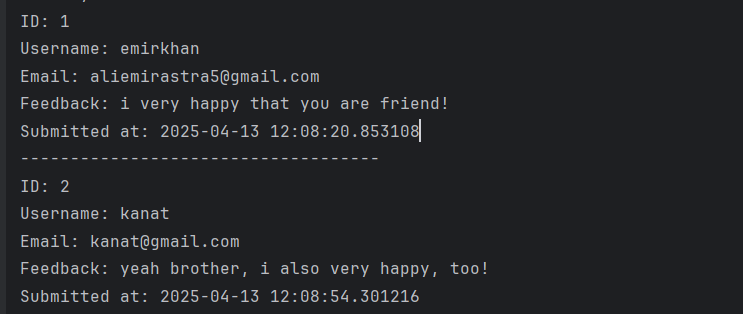
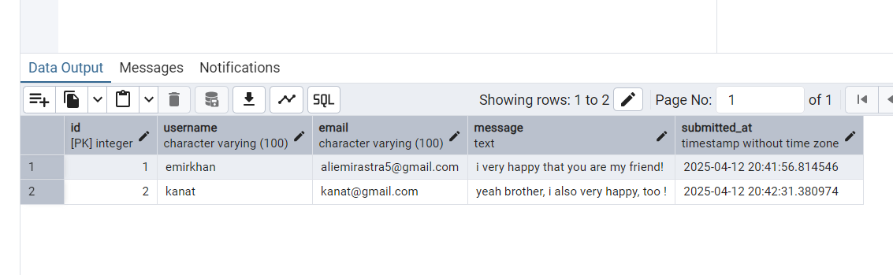
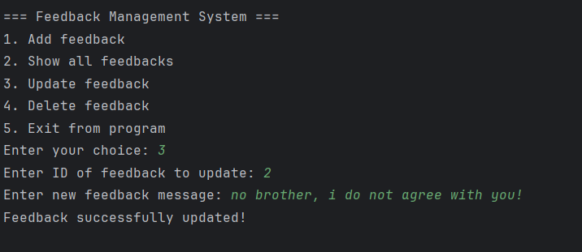
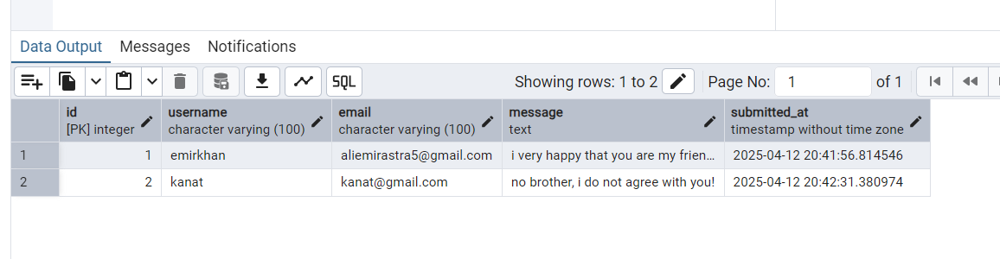
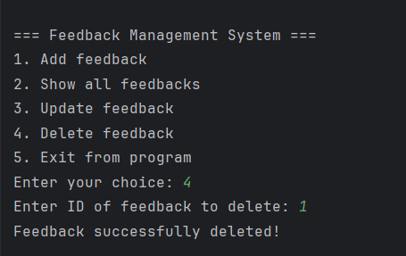
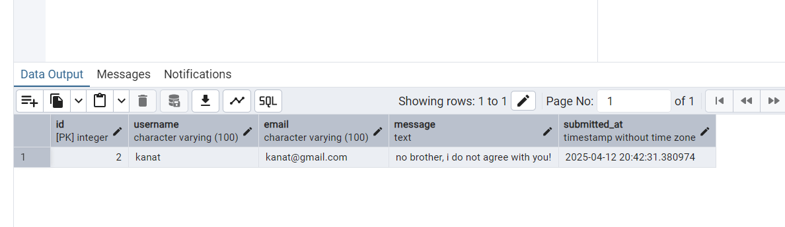

# **Feedback Management System**

## **Project Title and Description**
**Title:** Feedback Management System  
**Description:**  
The "Feedback Management System" is a console-based Java application designed for managing user feedback stored in a PostgreSQL database. The program implements basic CRUD operations (Create, Read, Update, Delete) for feedback records, features a user-friendly Command-Line Interface (CLI), and follows a modular structure for easier maintenance and expansion. The use of a database ensures secure and reliable data storage, as well as the ability to generate system and user activity reports.

**Author:** [Kaldarbekov Emirkhan]

---

## **Objectives**
The main objectives of this project are:
1. To develop a console-based application for managing user feedback.
2. To use PostgreSQL for database storage and management of feedback records.
3. To provide an intuitive and easy-to-use CLI for user interaction.
4. To implement input validation (e.g., email format, required fields) to reduce errors.
5. To structure the code modularly, making it easier to read and maintain.

---

## **Project Requirements**
This project satisfies the following requirements:

1. **CRUD Operations:** Implementation of Create, Read, Update, and Delete functionality for database management.
2. **PostgreSQL Database:** Data is stored in a `feedback` table in a PostgreSQL database to ensure reliable storage and scalability.
3. **Command-Line Interface (CLI):** A user-friendly menu allows users to perform actions like adding, deleting, or viewing feedback records.
4. **Input Validation:** Input correctness is enforced, such as valid email formats and mandatory fields.
5. **Error Handling:** Exceptions and database errors are handled gracefully, ensuring the program remains robust.
6. **Reports:** The program generates summary reports including total feedback entries and the most active user actions.
7. **Modularity:** The code is organized into separate functions/methods for each specific operation (e.g., add or delete feedback).
8. **JDBC Utilization:** Java Database Connectivity (JDBC) is used to interact with PostgreSQL and execute SQL queries.
9. **Testing:** Comprehensive testing was performed to ensure the program handles valid and invalid inputs correctly.
10. **Documentation:** The `Readme.md` file provides detailed documentation, including setup instructions, program structure, functional descriptions, and usage examples.

---

## **Implementation**

### **1. Data Storage**
The system stores all feedback data in a PostgreSQL database.

- **Database Name:** `final_project_db`
- **Table:** `feedback`, with the following structure:
```textmate
CREATE TABLE feedback (
    id SERIAL PRIMARY KEY,
    username VARCHAR(100) NOT NULL,
    email VARCHAR(100) NOT NULL,
    message TEXT NOT NULL,
    submitted_at TIMESTAMP DEFAULT CURRENT_TIMESTAMP
);
```

- **Columns Description:**
    - `id`: Unique identifier for each feedback entry.
    - `username`: Name of the user submitting the feedback.
    - `email`: User's email address.
    - `message`: Feedback message provided by the user.
    - `submitted_at`: Date and time of feedback submission.

---

### **2. Key Features**

1. **Create Feedback**: Users can input a username, email, and message to submit feedback. After validation, the data is stored in the `feedback` table.

2. **View Feedbacks**: The system displays all records from the database with details such as username, email, message, and submission date.

3. **Update Feedback**: Users can select a specific feedback entry by ID and update its message. The changes are saved in the database.

4. **Delete Feedback**: The program allows users to delete a specific feedback entry based on its ID, permanently removing it from the database.

5. **Reports**: The system generates reports highlighting total feedback counts, user activity, and the most frequent user actions.

---

### **3. Project Architecture**

The project is organized into the following components:

1. **Database Connection:**  
   The `getConnection()` method sets up a connection to the database:
```java
private static Connection getConnection() throws SQLException {
       return DriverManager.getConnection(
           "jdbc:postgresql://localhost:5432/final_project_db", 
           "your_username", 
           "your_password"
       );
   }
```
Replace `your_username` and `your_password` with your database credentials.

2. **CRUD Methods:**  
   Key database operations like adding, viewing, updating, and deleting feedback are encapsulated in specific methods: `addFeedback()`, `viewAllFeedbacks()`, `updateFeedback()`, and `deleteFeedback()`.

3. **Command-Line Interface (CLI):**  
   The user interacts with the program through a menu-driven CLI, which presents options to perform various feedback operations.

---

### **4. Example Methods**

Below are examples of key methods used in the application:

#### **Add Feedback**
This method adds a new feedback entry to the database:
```java
private static void addFeedback(String username, String email, String message) throws SQLException {
    String sql = "INSERT INTO feedback (username, email, message) VALUES (?, ?, ?)";
    try (Connection conn = getConnection(); PreparedStatement pstmt = conn.prepareStatement(sql)) {
        pstmt.setString(1, username);
        pstmt.setString(2, email);
        pstmt.setString(3, message);
        pstmt.executeUpdate();
    }
}
```

#### **View All Feedbacks**
This method retrieves and displays all records from the database:
```java
private static void viewAllFeedbacks() throws SQLException {
    String sql = "SELECT * FROM feedback";
    try (Connection conn = getConnection(); Statement stmt = conn.createStatement(); ResultSet rs = stmt.executeQuery(sql)) {
        while (rs.next()) {
            System.out.println("ID: " + rs.getInt("id"));
            System.out.println("Username: " + rs.getString("username"));
            System.out.println("Email: " + rs.getString("email"));
            System.out.println("Message: " + rs.getString("message"));
            System.out.println("Submitted At: " + rs.getTimestamp("submitted_at"));
            System.out.println("--------------------------------");
        }
    }
}
```

---

## **Testing**
The program was tested under the following scenarios to ensure functionality:

1. **Valid Input:** Submitted feedback with valid username, email, and message, which were successfully saved in the database.
2. **Invalid Input:** Entered empty fields or invalid email formats, and the program displayed error messages prompting corrections.
3. **Viewing Feedbacks:** Confirmed that all feedback entries are displayed correctly with their details.
4. **Updating Feedbacks:** Successfully updated the message field for a given feedback ID.
5. **Deleting Feedbacks:** Verified that data is permanently removed from the database.

---

## **Instructions for Running the Program**

1. Ensure PostgreSQL is installed and running on your system.
2. Create the database `final_project_db` and the `feedback` table using the provided SQL script.
3. Import the PostgreSQL JDBC driver into your Java project.
4. Update the `getConnection()` method with your database credentials.
5. Run the `Main.java` file to start the program.
6. Use the CLI menu to perform CRUD operations or generate reports.

---

## **Test Cases and Outputs**

1.



2. 



3. 




## **My challenges** 
1. **PostgreSQL Setup**:
      I faced challenges setting up the database, configuring the connection, and ensuring correct access permissions.

2. **Working with JDBC**:
      Finding and setting up the correct JDBC driver for PostgreSQL wasn't straightforward.


